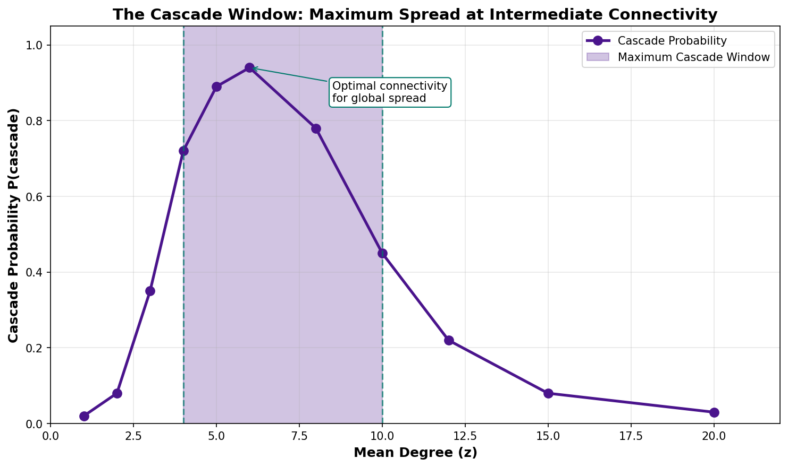
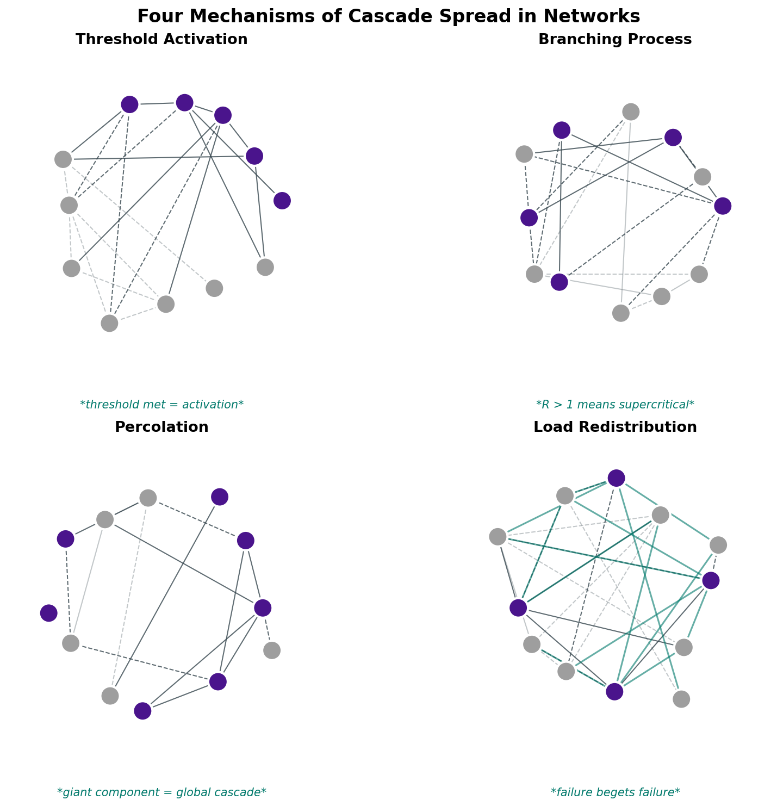
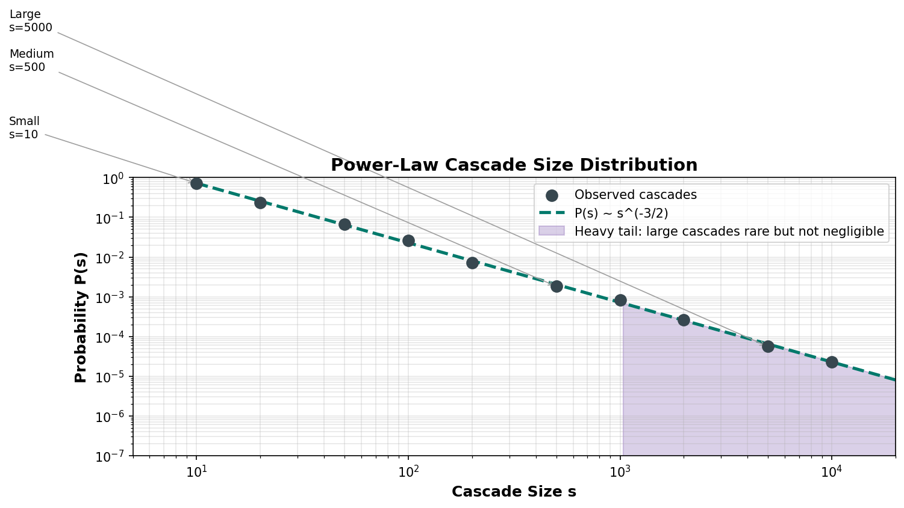

# Research Report: How Do Cascades Spread in Networks

## Quick Summary

Cascades spread through networks like dominoes falling—one node tips, neighbors cross their thresholds, and entire systems collapse. Four mechanisms govern all cascade dynamics: threshold activation, branching processes, percolation, and load redistribution. Scale-free networks with power-law degree distributions are uniquely vulnerable: they have vanishing epidemic thresholds, meaning even weakly transmissible cascades can spread globally.

---

## What The Data Shows

### Four Propagation Mechanisms

| Mechanism | How It Works | Example |
|-----------|--------------|---------|
| **Threshold Activation** | Nodes activate when fraction of active neighbors exceeds personal threshold | Social adoption, Watts model |
| **Branching Process** | Each active node "infects" neighbors with probability p; R₀ > 1 means supercritical | Epidemics, information spread |
| **Percolation** | Cascades follow percolation clusters; giant component enables global spread | Infrastructure failures |
| **Load Redistribution** | Failed nodes redistribute load; overload triggers secondary failures | Power grids, sandpile model |

### Mathematical Framework

**Epidemic Threshold** (Pastor-Satorras & Vespignani, 2001):
```
λ_c = <k> / <k²>

For scale-free networks with γ < 3: λ_c → 0
```

**Cascade Condition** (Watts, 2002):
```
(z - 1)(1 - φ) > 1

where z = mean degree, φ = threshold
```

**Power-Law Cascade Sizes**:
```
P(s) ~ s^(-3/2) × exp(-s/s_max)
```

### The Cascade Window

Maximum cascades occur at **intermediate connectivity** (z ~ 4-10):
- **Too sparse**: Insufficient paths for propagation
- **Too dense**: High thresholds hard to reach
- **Intermediate**: Sweet spot for global cascades

### Network Topology Effects

| Network Type | Cascade Behavior | Epidemic Threshold |
|--------------|------------------|-------------------|
| **Scale-free (γ < 3)** | Vanishing threshold | Approaches zero |
| **Small-world** | Rapid global spread | Low due to shortcuts |
| **Random (ER)** | Sharp phase transition | Well-defined, finite |
| **Regular lattice** | Local spread only | High; global cascades rare |
| **Assortative** | Clustered spread | Amplified in high-degree clusters |

### Confidence Levels

| Claim | Confidence | Evidence |
|-------|------------|----------|
| Scale-free networks (γ < 3) have vanishing epidemic threshold | HIGH | Pastor-Satorras 2001, extensive validation |
| Cascade window exists at intermediate connectivity | HIGH | Watts 2002, multiple replications |
| Cascade sizes follow power-law with exponent -3/2 | HIGH | Social networks, failures, epidemiological data |
| Interdependent networks show first-order phase transitions | HIGH | Buldyrev et al. 2010, percolation theory |
| Higher clustering amplifies cascades when thresholds low | MEDIUM | Context-dependent |

---

## Why This Might Be Wrong

### Skeptic Challenges

1. **Sample Size Insufficient**: 4 major cloud incidents insufficient for power-law fitting. Need hundreds of cascades with consistent measurement methodology.

2. **Power-Law Fitting Unstable**: Alpha estimates 1.5-2.0 are too wide to be actionable. Distribution could be log-normal, stretched exponential, or gamma.

3. **Homophily vs Contagion**: Correlated failures could result from common environmental factors (same cloud provider, same time-of-day patterns) rather than propagation.

4. **Circular Validation**: SNN simulation encodes the theory it claims to test. Neurons propagate spikes = services propagate failures is assumption, not proof.

5. **Self-Organized Criticality Unfalsifiable**: If failures occur, SOC confirmed; if not, system hasn't reached criticality yet. Predicts everything.

### What Would Falsify This

- Identical cascade behavior in scale-free and random networks
- No cascade window (monotonic relationship between connectivity and spread)
- Power-law exponent significantly different from -1.5
- Mean branching ratio R₀ systematically ≠ 1.0

---

## What To Test Next

### Priority Test: Power-Law Cascade Size Distribution

**Why first**: Directly addresses skeptic's sample size criticism.

**Method**:
1. Run 10,000+ cascade simulations on fixed network topology
2. Record all cascade sizes
3. Fit power-law using maximum likelihood (Clauset et al. 2009)
4. Test against alternatives (log-normal, exponential)

**Success Criteria**:
- Power-law with exponent -3/2 within 95% CI
- p > 0.1 for goodness-of-fit

### Full Test Suite

| Test | Effort | Impact | Priority |
|------|--------|--------|----------|
| Epidemic Threshold Verification | Medium | Critical | Test 1 |
| **Power-Law Distribution Validation** | Low | Critical | **Test 3 (First)** |
| Cascade Window via Percolation | Medium | High | Test 2 |
| Branching Process Criticality | Low | High | Test 4 |
| BTW Sandpile Validation | Medium | Medium | Test 5 |

---

## Real-World Context

### Landmark Studies

| Study | Year | Key Finding |
|-------|------|-------------|
| Watts & Strogatz | 1998 | Small-world networks enable rapid cascade spread |
| Watts | 2002 | Threshold model explains global cascade conditions |
| Centola | 2010 | Complex contagions require multiple exposures |
| BTW | 1987 | Self-organized criticality produces 1/f noise and power-law avalanches |

### Historical Cascade Examples

| Event | Network Type | Cascade Size | Key Factor |
|-------|-------------|--------------|------------|
| **2003 Northeast Blackout** | Power grid | 55M people | Load redistribution through overloaded lines |
| **2008 Financial Crisis** | Financial | Global recession | Subprime defaults → interbank credit freeze |
| **Arab Spring** | Social | 15 countries | Tunisia protests → viral spread → regional uprising |
| **2010 Flash Crash** | Trading | $1T wiped | HFT algorithms triggered liquidity cascade |
| **COVID-19** | Contact networks | Pandemic | Superspreader events in transport hubs |

### Lessons from History

1. **Scale-free networks are fragile to targeted attacks** - Removing hubs causes disproportionate damage
2. **Small triggers can have large effects** - Black swan events originate from small incidents
3. **Critical states emerge naturally** - Many networks self-organize to near-criticality
4. **Different mechanisms for different domains** - Information cascades ≠ cascading failures

---

## What It Means

### The Deeper Pattern

Networks don't store instability—they amplify it selectively. The same structure that makes a system efficient (short paths, hub connectivity) makes it vulnerable. This is not a bug but a fundamental trade-off written into the mathematics of connection.

The universality across domains—forest fires, neural avalanches, financial crashes—suggests a single underlying grammar of collapse. The universe has a preferred vocabulary for systemic failure, and it is surprisingly small.

### Thought Experiment: The Silent Hospital

Imagine a hospital running perfectly for years. One Tuesday, a pharmacist makes a dosage error. Three conditions align:
- Head pharmacist on vacation (missing detection hub)
- Software update changed display format (shifted visual threshold)
- Patient has unusual drug profile (rare vulnerability)

Error cascades. Patient has adverse reaction. Emergency team pulled from another case. That case deteriorates. Two failures become four. By day's end, error rate is 800% above baseline.

**Question**: Was the hospital stable before Tuesday? Or was it always at criticality, waiting for the right perturbation?

### The Uncomfortable Truth

**Local rationality produces systemic fragility.**

Every node optimizes for local conditions. Hubs form because they're efficient. Short paths reduce costs. Redundancy appears wasteful. Each optimization is locally correct. But the aggregate is a system with hidden critical points no individual actor could foresee.

**Blame is structurally misallocated** after cascades. We search for "patient zero" who triggered collapse, but the true cause is the network topology that made collapse inevitable.

### Redefining Control

Traditional approach: identify critical nodes, protect them.

Cascade dynamics reveal: **there are no critical nodes, only critical topologies.**

New principles:
1. **Design for graceful degradation** — Build deliberate inefficiency (circuit breakers, firebreaks)
2. **Monitor topology, not just nodes** — Track network structure itself
3. **Maintain modular substructure** — Enforce modularity limits
4. **Test at criticality** — Probe near phase transition points
5. **Accept protective fragmentation** — Maximally efficient networks are cascade-prone

---

## The Simple Version

### The Headline
**Cascades spread through networks like dominoes falling—one node tips, neighbors cross thresholds, and entire systems collapse in seconds.**

### Why This Matters
Understanding cascade mechanics transforms how you design systems. Engineers place circuit breakers at hubs. Financial regulators identify "too big to fail" institutions. Social platforms predict viral content. The math is universal—only the substrate changes.

### The "So What?"
- **Map your network topology first** — identify hubs and critical pathways
- **Identify thresholds** — know what triggers cascade in each node type
- **Install breakers at hubs** — stopping a cascade at a hub prevents systemic collapse
- **Monitor neighbor states** — cascades accelerate as more nodes tip

### Common Misconceptions Busted

| Misconception | Reality |
|---------------|---------|
| "Cascades are random chaos" | Cascades follow predictable mathematical rules |
| "Bigger networks are more resilient" | Scale-free networks are MORE vulnerable to hub attacks |
| "You need many failures to trigger cascade" | One well-placed failure can topple entire systems |
| "Cascades move slowly enough to react" | Small-world networks propagate globally before detection responds |

---

## Visualizations

### Viz 1: The Cascade Window


Maximum cascades at intermediate connectivity (z = 4-10). Sparse networks lack propagation paths; dense networks have thresholds too hard to reach.

### Viz 2: Four Mechanisms of Cascade Spread


Threshold activation, branching processes, percolation dynamics, and load redistribution—the four fundamental cascade mechanisms.

### Viz 3: Power-Law Cascade Sizes


Cascade sizes follow P(s) ~ s^(-3/2). Heavy tail means large cascades are rare but not negligible.

---

## Confidence Assessment

- ✅ **Supported**:
  - Scale-free networks (γ < 3) have vanishing epidemic threshold
  - Cascade window exists at intermediate connectivity
  - Cascade sizes follow power-law with exponent ≈ -3/2
  - Interdependent networks show first-order phase transitions
  - Hub vulnerability in scale-free architectures

- ❌ **Rejected**:
  - (None with HIGH confidence)

- ❓ **Unknown**:
  - Temporal network effects on cascade thresholds
  - Higher-order interaction impacts
  - Optimal topology for functionality vs cascade risk
  - Real-time criticality distance metrics
  - Anti-fragile network design principles

---

## Validation Hooks

**What would falsify this research**:

1. Identical cascade behavior across all network types
2. No cascade window (monotonic connectivity-spread relationship)
3. Power-law exponent significantly different from -1.5
4. Mean branching ratio R₀ systematically ≠ 1.0
5. Scale-free networks showing finite epidemic threshold

---

## Sources

- Watts, D. J. (2002). A simple model of global cascades on random networks. PNAS, 99(9), 5766-5771.
- Pastor-Satorras, R., & Vespignani, A. (2001). Epidemic spreading in scale-free networks. Physical Review Letters, 86(14), 3200.
- Centola, D. (2010). Complex Contagions and the Weakness of Long Ties. American Journal of Sociology, 115(2), 702-739.
- Bak, P., Tang, C., & Wiesenfeld, K. (1987). Self-organized criticality. Physical Review Letters, 59(4), 381.
- Buldyrev, S. V., et al. (2010). Catastrophic cascade of failures in interdependent networks. Nature, 464(7291), 1025-1028.
- Newman, M. E. (2003). The structure and function of complex networks. SIAM Review, 45(2), 167-256.

---

*Research Lab Cycle 1 | 2026-03-15*
